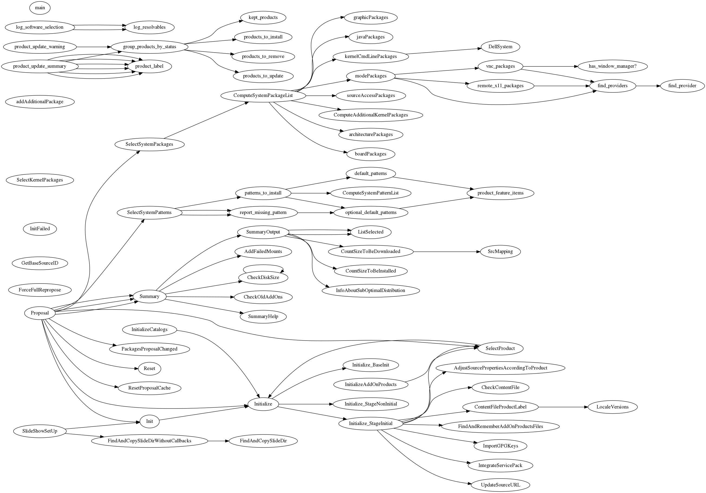

# Code Explorer

## Tools

### code-explorer

Starts a local web server which lets you apply the other tools to all `*.rb`
files in a directory subtree.

### call-graph

This makes a call graph among methods of a single Ruby file.

I made it to help me orient myself in unfamiliar legacy code and to help
identify cohesive parts that could be split out.

### class-dependencies

Identifies fully qualified class names and makes an inheritance graph

## Requirements

- [parser gem](https://github.com/whitequark/parser)
- [Graphviz](http://www.graphviz.org/)
- Sinatra
- Cheetah

## License

MIT

## Running from Source

```sh
bundle install --path vendor/bundle
bundle exec bin/code-explorer  # otherwise Sinatra will not start
```

## Example

[One file in YaST][p-rb] has around 2700 lines and 73 methods. The call graph
below was made with
```console
$ bin/call-graph ../yast/packager/src/modules/Packages.rb
$ dot -Tpng -oPackages.png ../yast/packager/src/modules/Packages.dot
```

If the resulting size is too big, use ImageMagick:
```console
$ convert Packages.png -resize 1200 Packages-small.png
```

[p-rb]: https://github.com/yast/yast-packager/blob/a0b38c046e6e4086a986047d0d7cd5d155af5024/src/modules/Packages.rb


